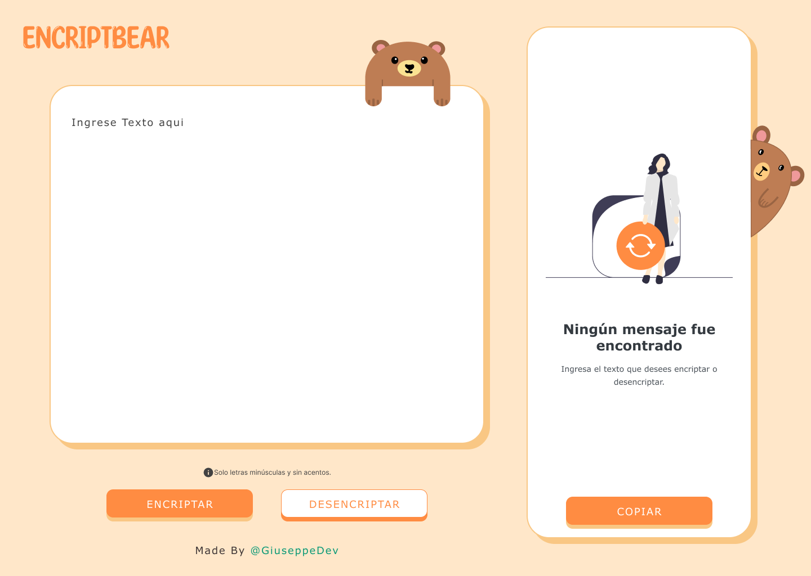
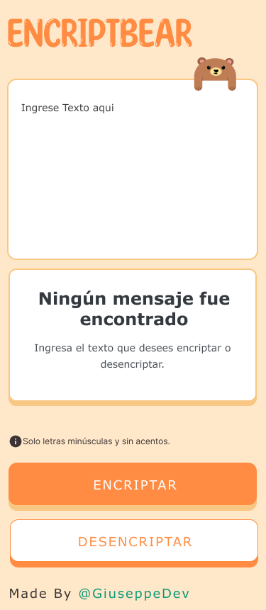

# EncriptBear

## Description
EncriptBear is a project that provides functionalities for encrypting and decrypting text in a straightforward manner. This tool is useful for safeguarding the privacy of sensitive messages by encrypting their content.

## Features
- Text encryption using secure algorithms.
- Decryption of previously encrypted text.
- Intuitive and user-friendly interface.

## Project Creation Video
Here you can watch a video showcasing the project creation process, including the initial design in Figma and the code implementation.

## Figma Designs
Below are the initial designs of the project created in Figma.

### Style Design

### PC Screen

### Tablet Screen

### Cellphone Screen
